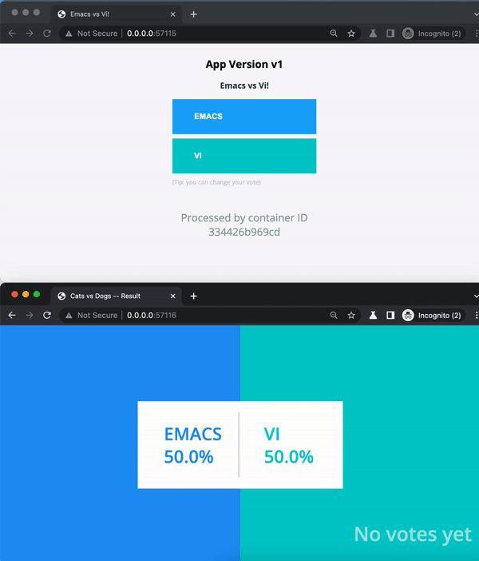

# Example Voting (Instavote) App

=========

## Getting started

This is a Polyglot application (python/node/java) that will be used to demonstrate
some of the common Continous Integration and Continous Delivery practices by leveraging
[Github Actions](https://docs.github.com/en/actions)](https://docs.github.com/en/actions).

## Architecture

* A Python webapp that lets you vote between two options
* A Redis queue that collects new votes
* A Java worker which consumes votes and stores them in…
* A Postgres database backed by a Docker volume
* A Node.js webapp that shows the results of the voting in real time

### Note

The voting application only accepts one vote per client. It does not register votes
if a vote has already been submitted by a client.

## Example

## Features

### Introduce Vote Application (python)

This introduces the workflow [python-app.yaml](.github/workflows/python-app.yaml)
that is triggered whenever a `pull_request` or `push` event is received. It performs
the next tasks

1. Checkout the source code
1. Setup Python 3.10
1. Install Package Dependencies and Auxiliary tools
1. Runs Linting and Style checks
1. Runs Automated Unit Tests
1. Checks for LeftOvers in the code

### Fix Linter Issues and Add Coverage Information

Fixing the first iteration of the code we added the next changes

1. Fix Linter findings for the `vote` application
1. Publish Test Results to the Action Run
1. Introduces `pytest-cov` to track Coverage information
1. Publish Coverage Data

### Add container builds for the `vote` application

The goal here is to introduce Docker builds for the application along with some other refactorings
to improve configurability.

1. Add `PYTHON_VERSION` to the workflow execution
1. Add `container` job to perform the next tasks
    1. Dependency on the build job
    1. Set Qemu for multi-arch builds
    1. Set BuildX for improved performance
    1. Local Build for Images (not pushing)

### Login to GitHub Container Registry

Introduce the faculty to push images to the GitHub registry:

1. Login to GitHub Container Registry
    1. Secrets are managed by GitHub via `secrets.GITHUB_TOKEN`
    1. Update the Taging and Push settings

### Add smoke test

Add Smoke Test for the just built images to check its behavior:

1. Dependency on the `container` build job.
1. Login to the GitHub Registry
1. Bring up the application via `docker compose up`
    1. Added `vote/docker-compose.yml` to manage the infrastructure provisioning
1. Smoke test via `curl` and status code 200

### Add Java Workflow (worker)

Introduce the java application `worker` build via its own workflow [maven-app.yaml](.github/workflows/maven-app.yaml)

1. Add new workflow to build maven projects
    1. Take advantage of the caches
    1. Add Unit Test Checks
    1. Add Container builds
    1. Add smoke test
1. Refactored the `check-dirty-repo` into a composite action to be reused
1. Refactored the `container` build into a Reusable workflow [container-build.yaml](.github/workflows/container-build.yaml)
1. Add specific path triggers for the application

### Add Node Workflow (results)

Introduce the node application `results` build via its own workflow [node-app.yaml](.github/workflows/node-app.yaml)

1. Add new workflow to build node projects
    1. Add Unit Test Checks
    1. Add Container builds
    1. Add smoke test

### Introduce Pull Request workflow

Introduce [pull-request.yaml](.github/workflows/pull-request.yaml) workflow and
reusable workflows templates `workflow_call` to track from a simple point the interactions
between modules.

1. Convert language-oriented workflows into reusable workflows to be called.
1. Parametrize by `MICROSERVICE`

### Security Hardening

Introduce Security checks for all the workflows.

1. Trivy for Container Vulnerabilities
1. Add `security` job to handle security findings
    1. Check for Leaked secrets via `trufflehog`
    1. Add CodeQL checks
    1. Add License Checking
        1. Generate Dynamic matrix with scripting
