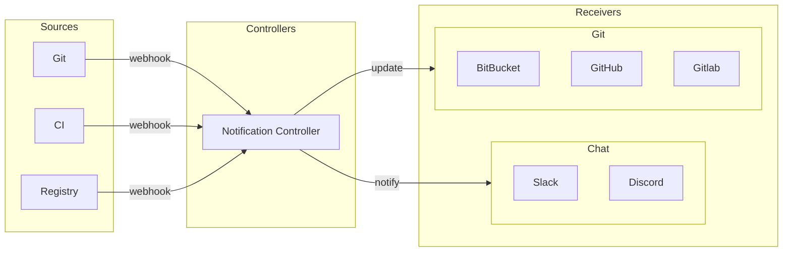

# Features of a Notification Controller

```mermaid
flowchart LR
    source-git["Git"];
    s-ci["CI"];
    source-registry["Registry"];
    controller-notification["Notification Controller"];
    receiver-slack["Slack"];
    receiver-discord["Discord"];
    receiver-bitbucket["BitBucket"];
    receiver-github["GitHub"];
    receiver-gitlab["Gitlab"];

    %% Dependencies
    source-git -- webhook --> controller-notification
    s-ci -- webhook --> controller-notification
    source-registry -- webhook --> controller-notification

    controller-notification -- notify --> Chat;
    controller-notification -- update --> Git;

    subgraph Sources
        source-git
        s-ci
        source-registry
    end

    subgraph Controllers
        controller-notification;
    end

    subgraph Receivers
        subgraph Chat
            receiver-slack;
            receiver-discord;
        end
        subgraph Git;
            receiver-bitbucket;
            receiver-github;
            receiver-gitlab;
        end
    end
```
