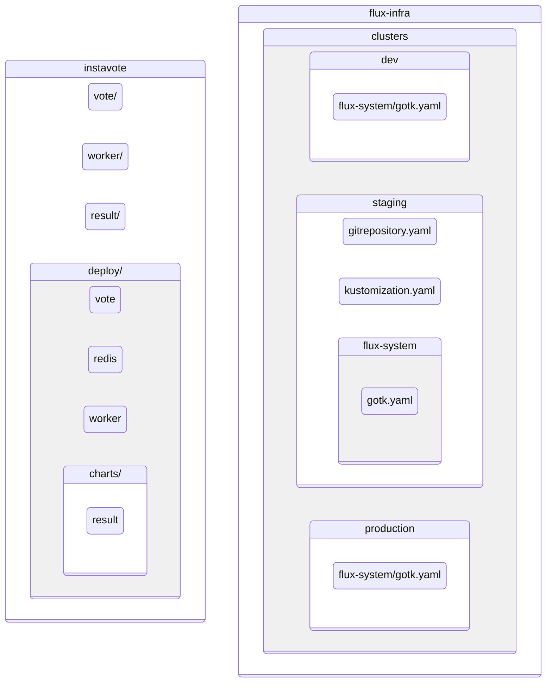
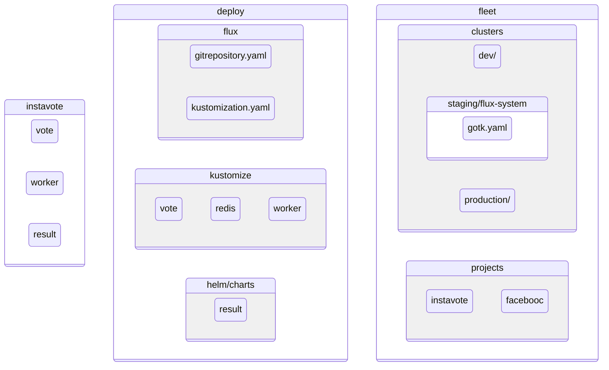

# The Need for Multi-Tenancy

## Current Implementation

Problems with this setup:

- Both Dev & Ops teams have access to the `flux-infra` resources:
  - Cluster configs
  - All namespaces
  - All environments
- All code in one place `instavote`
- Onboard of new projects is hard

## Design for Multi-Tenancy

Impvoments:

- CI/CD cycles on separate cycles
  - One change to the application code does not trigger a deployment automatically
  - One change to the deployment code does no trigger a build in the app
- Application specific codes contained in the namespace (tenant)
- `fleet` repository only accesible to SRE and Platform engineers

## Futher Reading:

* https://github.com/fluxcd/flux2-multi-tenancy
